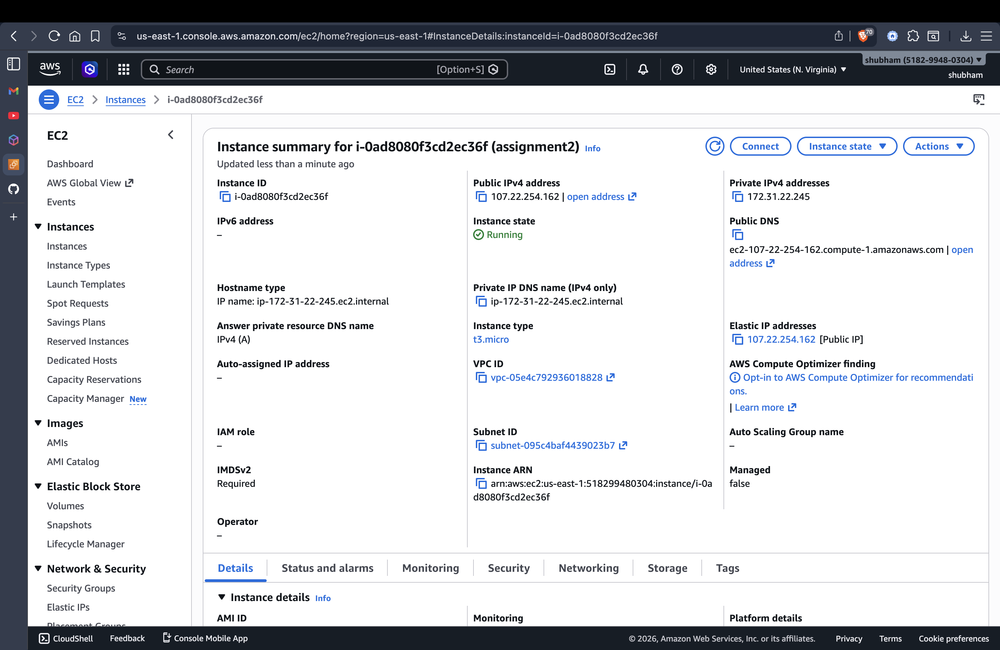
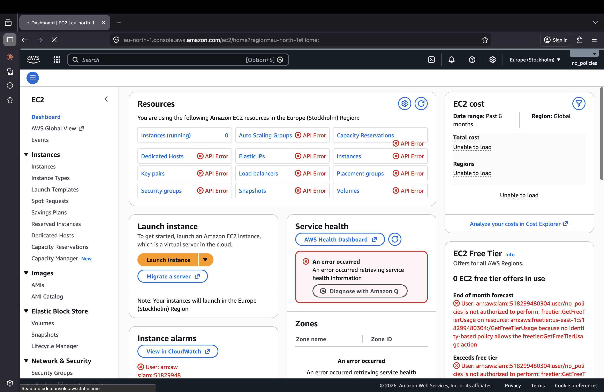
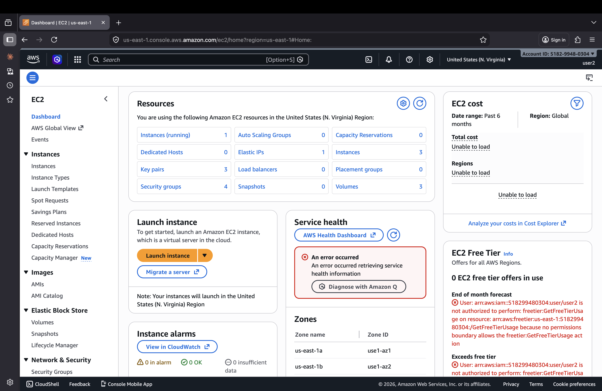

# Assignment 01 — AWS EC2 Static Website Hosting with IAM Access Control

> **Cipher Schools | Phase 2 | Cloud Computing | April 2026**

---

## 🌐 Deployed Project Link

**[http://107.22.254.162](http://107.22.254.162)**

> Hosted on AWS EC2 (t3.micro) via Apache2 web server, served using Elastic IP.

---

## 🖥️ EC2 Instance Screenshot

> EC2 instance `i-0ad8080f3cd2ec36f` (assignment2) running in us-east-1 (N. Virginia). Username `shubham` visible in the top-right corner of the AWS Console.



---

## 👤 IAM User 1 — No Policies (no_policies)

This user has **no permissions attached**. Every EC2 resource shows **"API Error"** — the user cannot view or interact with any AWS services.



---

## 👥 IAM User 2 — EC2 Full Access (user2)

This user has **AmazonEC2FullAccess** policy attached. They can view and interact with EC2 instances. Screenshot shows **Instances (running): 1** visible in the EC2 dashboard.



---

## 🚀 Setup Steps

### 1. Launch EC2 Instance
- AMI: Ubuntu 22.04 LTS
- Instance Type: t3.micro (Free Tier)
- Security Group: Allow HTTP (port 80) and SSH (port 22) from 0.0.0.0/0
- Key Pair: `assignment2key.pem`

### 2. Allocate & Associate Elastic IP
- Allocated Elastic IP: `107.22.254.162`
- Associated with instance `i-0ad8080f3cd2ec36f`

### 3. Connect & Install Apache2
```bash
chmod 400 assignment2key.pem
ssh -i "assignment2key.pem" ubuntu@107.22.254.162

sudo apt update -y
sudo apt install apache2 -y
sudo systemctl start apache2
sudo systemctl enable apache2
```

### 4. Deploy the Website
```bash
sudo cp index.html /var/www/html/
sudo cp style.css /var/www/html/
sudo cp script.js /var/www/html/
sudo chmod 644 /var/www/html/*.html /var/www/html/*.css /var/www/html/*.js
```

### 5. Verify
```bash
curl -o /dev/null -w "%{http_code}" http://localhost/
# Returns: 200
```

---

## 🔒 IAM Users Setup

### IAM User 1 — `no_policies`
- **Policies:** None (zero permissions)
- **Console Access:** Yes
- **Effect:** API Error on all AWS services — cannot view EC2, S3, or anything

### IAM User 2 — `user2`
- **Policies:** `AmazonEC2FullAccess`
- **Console Access:** Yes
- **Effect:** Can view and interact with all EC2 resources in us-east-1

---

## 🏗️ Architecture

```
User Browser → Internet → Elastic IP (107.22.254.162) → EC2 Instance (Apache2 :80) → Website
                                                              ↓
                                                    IAM Access Control
                                                   no_policies: ❌ API Error on all
                                                   user2: ✅ EC2 Full Access
```

---

## 🛠️ Tech Stack

| Technology | Usage |
|---|---|
| AWS EC2 (t3.micro) | Compute instance |
| Apache2 | Web server (port 80) |
| Elastic IP (107.22.254.162) | Static public IP |
| AWS IAM | Identity & access management |
| HTML5 / CSS3 / JS | Static website |
| Ubuntu 22.04 LTS | OS on EC2 |

---

## ⚡ Challenges Faced

1. **Port 80 conflict** — When Apache2 was first installed, Nginx was already running on port 80. Had to stop Nginx before Apache2 could start.
2. **Wrong region for IAM User** — User2 was initially viewing Europe (Stockholm) region and saw no instances. Switching to US East (N. Virginia) showed the running instance correctly.
3. **Password policy** — IAM auto-generated password required a reset on first login. The new password had to meet strict complexity requirements (uppercase, lowercase, numbers, special characters).
4. **Elastic IP association** — Had to explicitly associate the Elastic IP to the instance after allocating it; it doesn't auto-attach.
5. **Security Group** — Forgot to open port 80 (HTTP) initially; added inbound rule for HTTP from 0.0.0.0/0.

---

## 📁 Repository Structure

```
├── index.html              # Main webpage
├── style.css               # Styling
├── script.js               # JavaScript
├── README.md               # This file
└── screenshots/
    ├── ec2-console.png     # EC2 console (username visible)
    ├── user1-no-access.png # no_policies user (API errors)
    └── user2-ec2-access.png # user2 (EC2 instances visible)
```

---

## 👨‍💻 Author

**Shubham**
GitHub: [shubham0915](https://github.com/shubham0915)
Cipher Schools — Cloud Computing (Phase 2) | Assignment 01 | April 2026
