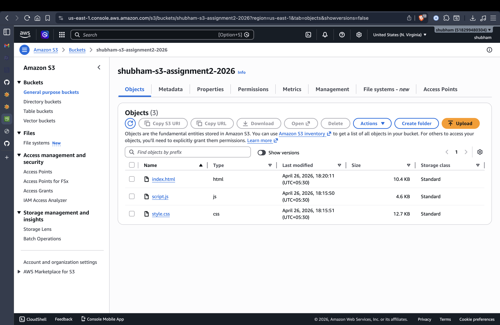
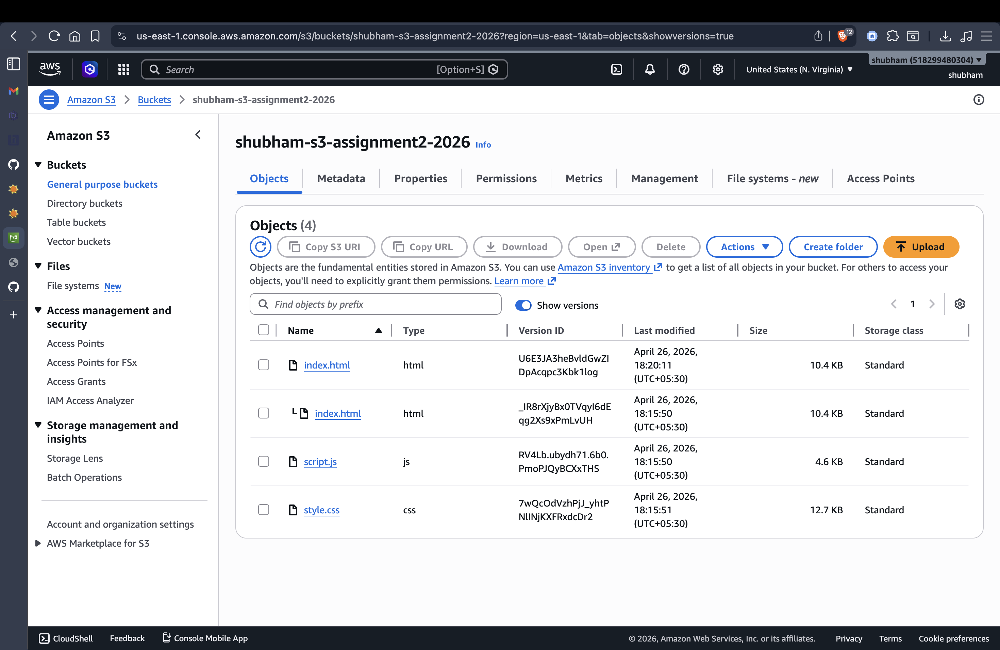
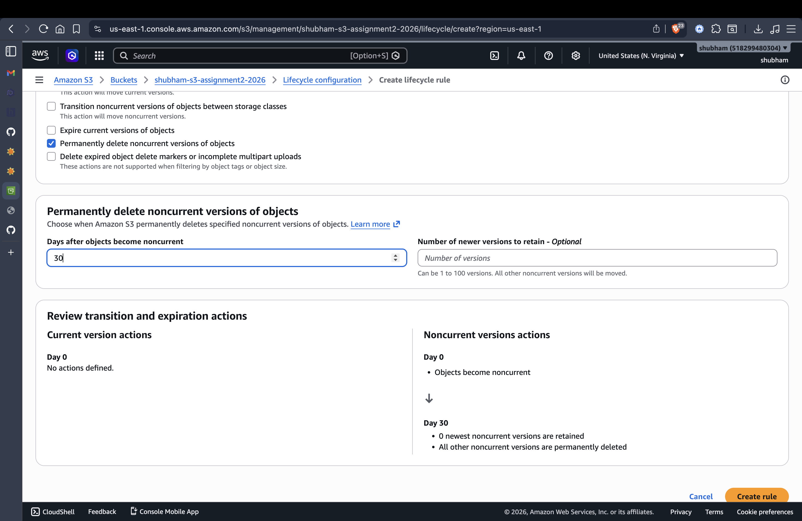

# Assignment 02: AWS S3 Static Website Hosting with Versioning & Lifecycle Management

**Name:** Shubham  
**Registration Number:** 12310611  
**Deployed Website Link:** [http://shubham-s3-assignment2-2026.s3-website-us-east-1.amazonaws.com](http://shubham-s3-assignment2-2026.s3-website-us-east-1.amazonaws.com)  

---

## Screenshots

### 1. S3 Bucket with Uploaded Files Visible

### 2. Versioning View Showing Multiple Versions of a File

### 3. Lifecycle Rule Configuration

---

## Challenges Faced
During this assignment, configuring the correct Bucket Policy in JSON format to ensure the website was publicly accessible required careful attention. Additionally, verifying that all files were uploaded correctly at the root level so that the `index.html` file could serve as the website's index document was an important learning step.
